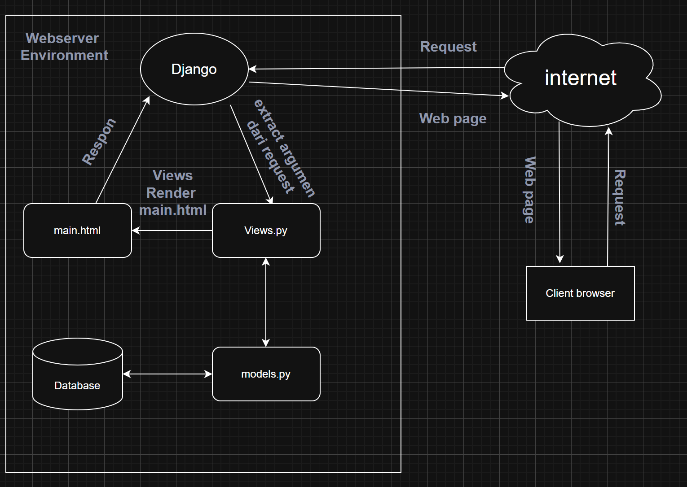
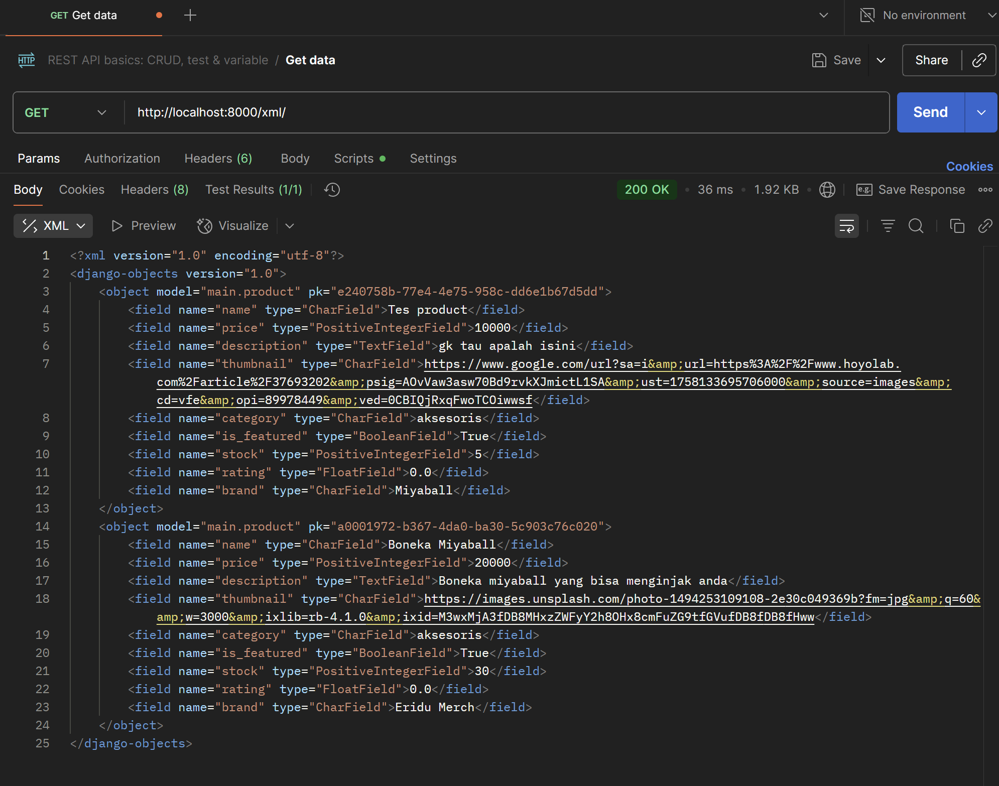
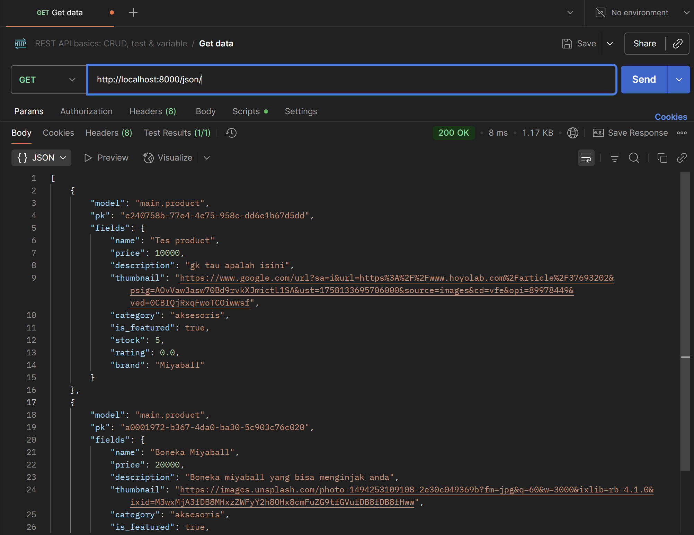
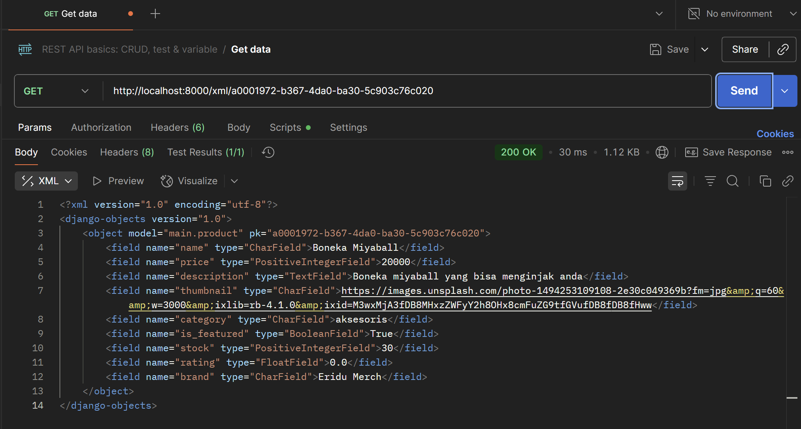
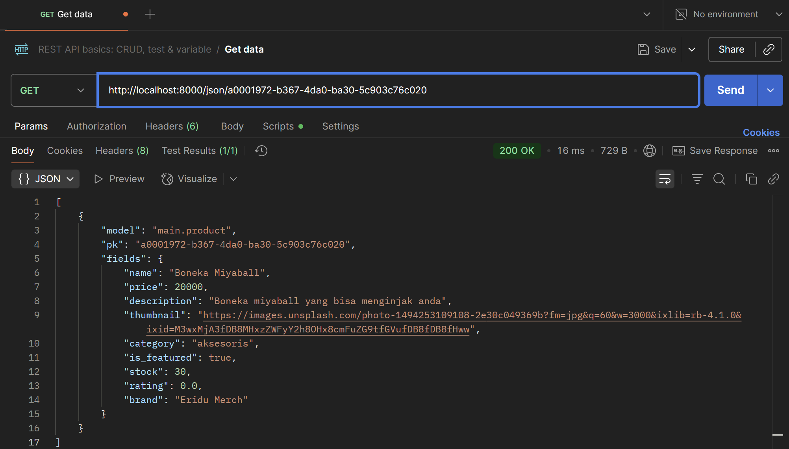

Tugas 2

## Link Aplikasi
(https://muhammad-yufan-footballshop.pbp.cs.ui.ac.id)

## 1. Jelaskan bagaimana cara kamu mengimplementasikan checklist di atas secara step-by-step
1. **Membuat Proyek Django Baru**
    -membuat direktori tempat file project django disimpan dan buka command promp
    -membuat dan menyalakan virtual environment yang berguna untuk package dan dependency agar tidak bertabrakan dengan versi lain
    -menginstal dependencies yang digunakan
    -membuat proyek dengan command `django-admin startproject <nama_project> .`
    -konfigurasi environment dan proyek
    -menambahkan host yang dapat mengakses server
2. **Membuat Aplikasi `main`**
    membuat aplikasi baru dengan menggunakan command `python manage.py startapp <nama_aplikasi>`
3. **Routing Proyek**
    menambahkan aplikasi kedalam 'INSTALLED_APPS' didalam settings.py direktori project untuk medaftarkan aplikasi
4. **Membuat Model `Product`**
    -membuka models.py dalam direktori aplikasi main untuk mendefinisikan mode dalam hal ini membuat class product beserta dengan atribut dan functionnya
    -migrasikan model ke database lokal
5. **Membuat View `show_main`**
    membuat fungsi didalam views.py yeng berisi nama aplikasi, nama, npm, dan kelas 
6. **Membuat Template HTML (`main.html`)**
    -membuat direktori templates didalam direktori main dan membuat file html didalam templates tersebut
    -mengisi file html dengan apa yang ingin ditampilkan
7. **Routing fungsi `show_main` ke `main.html` melalui `urls.py`**
    -membuat berkas urls.py didalam direktori main
    -membuat routing url pada aplikasi main
    -mengonfigurasi url projek
    -menambahkan url main kedalam url project
8. **Testing**
    membuat test case untuk tes models.py
9. **Deployment ke PWS**  
    membuat projek pada pws dan push ke pws

---

## 2. Bagan Alur Request-Response

- **`urls.py`** → memetakan URL path ke fungsi kelas view  
- **`views.py`** → menerima request, berinteraksi dengan modls.py, dan mengembalikan respon
- **`models.py`** → definisi kelas model yang disimpan di database  
- **`templates`** →  menampilkan context dari views.py dan menampilkannya ke browser client

---

## 3. Fungsi `settings.py`
setting.py adalah pusat kontrol Django yang mengatur keamanan, aplikasi yang terinstal, Middleware, Host, database, dan zona waktu

---

## 4. Cara Kerja Migrasi
1. gunakan command `python manage.py makemigrations` maka django akan membandingkan model dengan history migrasi dan membuat file migrasi
2. lanjutkan dengan command `python manage.py migrate` Django akan menjalankan migrasi dan memasukkan model kedalam database

---

## 5. Kelebihan Django
-framework django menggunakan bahasa python yang merupakan high level language programing yang mendekati bahasa manusia sehingga lebih mudah dipahami
-framework django memiliki struktur yang teratur membantu programmer pemula dalam memahami framework
-framework django juga memiliki keamanan tinggi dan cepat
-framework django dapat di projek kecil dan besar sehingga lebih fleksibel
-framework django gratis dan open source 

---

Tugas 3

## 1. Jelaskan mengapa kita memerlukan data delivery dalam pengimplementasian sebuah platform?
data delivery diperlukan agar komponen-komponen didalam platform dapat saling berkomunikasi 

---

## 2. Mana yang lebih baik antara XML dan JSON? Mengapa JSON lebih populer dibandingkan XML?
menurut saya JSON lebih baik dari XML karena data yang dikeluarkan JSON lebih mudah dibaca karena model yang dipakai mirip dengan dictionary, dan json tidak banyak menggunakan tag yang membuatnya lebih ringan dan efisien

---

## 3. Fungsi dari method`is_valid()`
method is_valid pada django digunakan untuk mevalidasi data yang dikirim melalui form dengan cara mengecek apakah semua field telah sesuai aturan dan jika tidak lengkap maka akan tersimpan di form.error 

---

## 4. Fungsi `csrf_token`
csrf_token diperlukan untuk meverifikasi bahwa yang mengirim form benar-benar user dengan cara saat user menerima form django juga mengenerate token yang dikirim bersamaan dengan formnya dan saat user mengirim kembali form juga akan kembali mengirimkan token tersebut dan akan di cek oleh django. jika tidak menggunakan csrf_token maka django tidak dapat meverifikasi apakah form yang diterima. penyerang dapat menggunakan kelemahan ini dengan cara membuat website dengan form tersembunyi lalu mengirim lalu mengirim form tersebut ke server asli tanpa user sadari

---

## 5. Jelaskan bagaimana cara kamu mengimplementasikan checklist di atas secara step-by-step
1. **menambahkan 4 fungsi baru yaitu `show_xml`, `show_json`, `show_xml_by_id`, dan `show_json_by_id`**
    untuk JSON dan XML: membuat varibel yang menyimpan hasil query dari seluruh data yang ada pada Product lalu du serialisasi menjadi XML atau JSON lalu mereturn dalam bentuk HttpResponse.
    untuk JSON dan XML by id: sama seperti diatas tetapi hanya menyimpan hasil query dari data dengan id tertentu yang terdapat pada Product

2. **Routing fungsi melalui `urls.py`**
    mengimport masing-masing fungsi yang sudah dibuat di step pertama dari views.py dan menambahkan path didalam urls pattern dengan route, fungsi yang akan digunakan dari views.py dan nama url

3. **Membuat form untuk menerima input dari client**
    membuat file `forms.py` sebagai form yang akan di isi oleh client lalu pada halaman utama atau `main.html` membuat tombol yang akan merouting client ke halaman form, membuat halaman form yang akan mencek csrf token terlebih dahulu lalu membuat form yang akan menerima input user dan menyimpan model tersebut kedalam database lalu setelah form selesai diisi dan sudah disubmit ke database meredirect kembali client ke halaman utama

4. **Membuat halaman yang menampilkan detail dari setiap data objek model**
    membuat halaman detail atau file html baru yang akan menampilkan detail dari product yang sudah disubmit melalui form dan membuat tombol di halaman utama untuk medirect client ke halaman detail dan tombol dihalaman detail yang akan meredirect user kembali ke halaman utama

## 6. Screenshot dari hasil akses URL pada Postman

---

Tugas 4

## 1. Apa itu Django AuthenticationForm? Jelaskan juga kelebihan dan kekurangannya.
`AuthenticationForm` adalah form bawaan Django yang digunakan untuk proses login. Form ini menyediakan field username dan password, melakukan validasi kredensial, dan mengembalikan objek user yang berhasil diautentikasi melalui `form.get_user()`
**Kelebihan**
    -Siap pakai, tidak perlu membuat form login manual.
    -Validasi username & password aman dan sesuai standar Django.
    -Terintegrasi langsung dengan sistem autentikasi Django (backend auth).

**Kekurangan **
    -Default hanya mendukung login dengan username dan password. Jika ingin login dengan email/field lain maka perlu membuat custom form.
    -Tidak menyediakan field tambahan seperti “remember me” tanpa override.
    -Tidak ada tampilan bawaan, hanya form backend.
---

## 2. Apa perbedaan antara autentikasi dan otorisasi?
- **Autentikasi**: adalah proses memverifikasi identitas user 
- **Implementasi django terhadap autentikasi**: ditangani oleh `authenticate()`, `login()`, `middleware AuthenticationMiddleware`, dan atribut `request.user`.  
- **Otorisasi**: adalah proses menentukan hak akses user
- **Implementasi django terhadap otorisasi**: melalui sistem Permission, Group, `User.has_perm()`, decorator `@permission_required`, `@login_required`, dan class-based mixins seperti PermissionRequiredMixin.

---

## 3.  Apa saja kelebihan dan kekurangan session dan cookies dalam konteks menyimpan state di aplikasi web?
**kelebihan cookies**
    -disimpan disisi client sehingga tidak membebani server, karena data langsung disimpan di browser pengguna
    -bisa diatur masa berlakunya, jadi cocok untuk “remember me” atau preferensi jangka panjang
    -browser akan mengirim cookies setiap request ke domain yang sesuai
    -bisa diakses dari JavaScript

**kekurangan cookies**
    -kurang aman, rentan dicuri (misalnya lewat XSS) kalau tidak di-encrypt/secure
    -ukuran yang terbatas biasanya maksimal sekitar 4KB per cookie, jadi tidak cocok untuk menyimpan data besar
    -menambah overhead bandwidth karena setiap request ke server membawa cookie
    -butuh perlindungan tambahan agar tidak disalahgunakan

**kelebihan session**
    -lebih aman karenadata disimpan di sisi server, client hanya menyimpan session ID (biasanya lewat cookie)
    -bisa menyimpan data yang besar karena server bebas menyimpan data kompleks (object, struktur data).
    -session bisa otomatis berakhir saat browser ditutup atau setelah idle tertentu.
    -cocok untuk data sensitif (misalnya data login, shopping cart) karena tidak terekspos langsung ke client.

**kekurangan session**
    -membebani server, semakin banyak user aktif, semakin besar beban memori/penyimpanan di server
    -butuh session sharing (misalnya Redis, database) jika pakai banyak server (load balancing)
    -butuh cookie/URL rewriting untuk menyimpan session ID, tanpa itu, session tidak bisa dikenali
    -rentan session hijacking jika session ID dicuri 

---

## 4. Apakah penggunaan cookies aman secara default dalam pengembangan web, atau apakah ada risiko potensial yang harus diwaspadai? Bagaimana Django menangani hal tersebut?
Cookies tidak sepenuhnya aman secara default 
**Resiko**
    -XSS (Cross Site Scripting): attacker bisa mencuri cookie jika cookie bisa diakses JS
    -CSRF (Cross Site Request Forgery): attacker bisa menyalahgunakan cookie untuk melakukan aksi tanpa izin
    -Manipulasi data: user bisa mengubah cookie di sisi client.
**cara django menangani resiko**
    -menggunakan HttpOnly=True untuk session cookie (default) untuk mencegah akses JS ke cookie.
    -SESSION_COOKIE_SECURE dan CSRF_COOKIE_SECURE (production), hanya kirim cookie lewat HTTPS
    -sameSite option (Lax/Strict), mencegah CSRF
    -CSRF protection via middleware &  di form
    -session ID di-cookie dienkripsi & ditandatangani

---

## 5. Jelaskan bagaimana cara kamu mengimplementasikan checklist di atas secara step-by-step

-menambahkan import UserCreationForm di views.py untuke mudahkan pembuatan formulir pendaftaran pengguna dalam      aplikasi web
    -menambahkan fungsi register didalam views.py dan membuat file register.html lalu meroutingnya melalui urls.py
    -menambahkan import authenticate, login, dan AuthenticationForm yang dapat digunakan untuk melakukan autentikasi dan login (jika autentikasi berhasil) di views.py.
    -menambahkan fungsi login ke dalam views.py dan membuat file login.html lalu meroutingnya malalui urls.py
    -menambahkan import logout di views.py
    -menambahkan fungsi logout ke dalam views.py dan meroutingnya melalui urls.py

---

Tugas 5

## 1. Jika terdapat beberapa CSS selector untuk suatu elemen HTML, jelaskan urutan prioritas pengambilan CSS selector tersebut!
Jika ada beberapa CSS yang menargetkan elemen yang sama, browser akan memilih CSS yang lebih spesifik. Urutannya:

1. **Inline style**
    Contoh: `

` → memiliki prioritas tertinggi.

2. **ID selector (#id)**
    Contoh:` #header { color: blue; }` → lebih spesifik daripada class.

3. **Class, pseudo-class, attribute selector (.class, :hover, [type="text"])**
    Contoh: `.menu { color: green; }`

4. **Element selector (tag, seperti div, p, h1)**
    Contoh: `p { color: black; }` → prioritas paling rendah.

5. **Important (!important)**
    Bisa menimpa aturan lain, tapi sebaiknya digunakan dengan hati-hati.

---
## 2. Perbedaan Asynchronous vs Synchronous
Responsive Design artinya desain web dapat menyesuaikan tampilan pada berbagai ukuran layar, seperti desktop, tablet, atau smartphone.

**Mengapa penting:**
    -Banyak pengguna mengakses website melalui mobile atau tablet.
    -Meningkatkan user experience dan aksesibilitas.
    -Membantu SEO karena Google lebih menyukai website yang mobile-friendly.

**Contoh aplikasi yang sudah menerapkan:**
    -Google Docs
    -Instagram web

**Contoh aplikasi yang belum menerapkan:**
    -Situs lama berita

---
## 3.  Jelaskan perbedaan antara margin, border, dan padding, serta cara untuk mengimplementasikan ketiga hal tersebut!
Margin → ruang di luar elemen, memisahkan elemen dengan elemen lain.
    Contoh: `margin: 10px;` → memberi jarak 10px di luar kotak elemen.

Border → garis tepi elemen.
    Contoh: `border: 2px solid black;` → membuat kotak dengan garis 2px.

Padding → ruang di dalam elemen, antara isi (content) dan border.
    Contoh: `padding: 15px;` → jarak antara konten dan garis border.

---
## 4. Jelaskan konsep flex box dan grid layout beserta kegunaannya!
**Konsep Flexbox**
    -Elemen di dalam container bisa mudah disejajarkan secara horizontal maupun vertikal.
    -Membantu membuat layout yang fleksibel dan responsif tanpa perlu banyak kalkulasi manual.
    -Properti utamanya ditaruh di container (`display: flex;`), lalu anak-anaknya mengikuti aturan flex.

**Kegunaan Flexbox**
    -Membuat navbar dengan menu rata kanan & kiri.
    -Menyusun card produk secara horizontal.
    -Memusatkan konten di tengah layar dengan mudah.

**Konsep Grid layout**
    -Container dibagi menjadi baris (rows) dan kolom (columns).
    -Elemen bisa ditempatkan di posisi tertentu di dalam grid dengan mudah.
    -Cocok untuk membuat layout kompleks seperti dashboard, galeri foto, atau struktur halaman.

**Kegunaan Grid layout**
    -Membuat layout halaman penuh (header, sidebar, content, footer).
    -Membuat galeri dengan baris & kolom yang teratur.
    -Mengatur elemen agar responsif dalam bentuk kotak.

---
## 5. Jelaskan bagaimana cara kamu mengimplementasikan checklist di atas secara step-by-step

---   